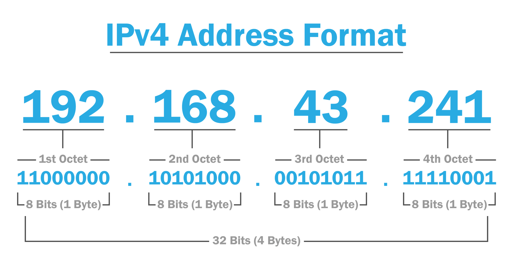
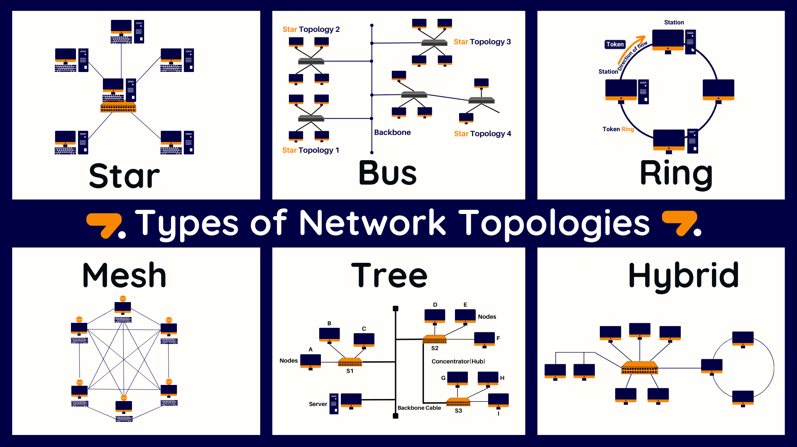
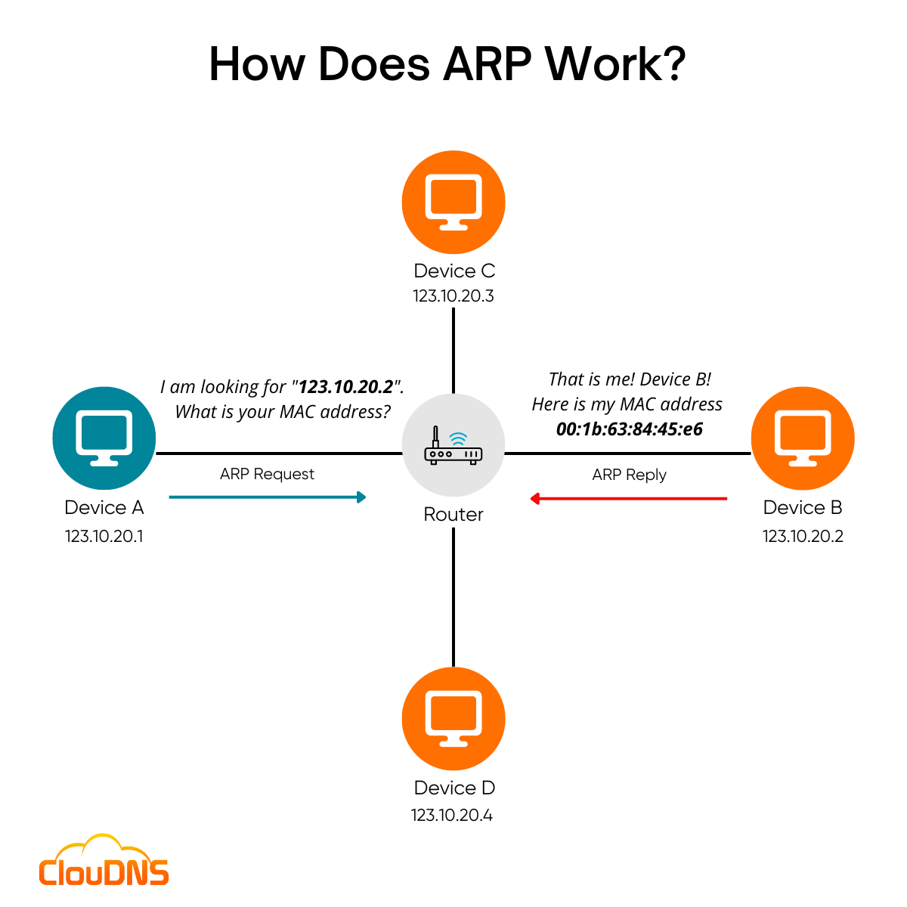

<blockquote>
    
<em>PT Este documento é um resumo feito durante o curso do THM de Pré-Segurança. São notas pessoais.</em>

    
<em>EN This document is a summary made during the Pre-Security THM course. These are personal notes.</em>

</blockquote>

<h1 align="center">Pre-Security</h1>

    
<h2>Network Fundamentals</h2>

        
<h3>What is Networking?</h3>
<ul><li>Rede é um sistema de conexão entre pontos (computadores)</li></ul>

<h4>What is the internet</h4>
<ul>
    <li>Internet é uma rede gigante com várias redes menores (locais)</li>
    <li>Criada pelo Departamento de Defesa Americano</li>
    <li>Em 1989 por Tim Berners-Lee foi feita a WWW (World Wide Web)</li>
    <li>Rede de internet pode ser:
        <ul>
            <li>Privada</li>
            <li>Pública</li>
        </ul>
    </li>
</ul>

<h4>Identifying Devices on a Network</h4>

Para que a comunicação seja organizada é preciso identificar os elementos

<strong>Endereço de IP</strong>

<ul>
    <li>Mais conhecido como <strong>I</strong>nternet <strong>P</strong>rotocol</li>
    <li>Usado para identificar o host dentro de uma rede</li>
    <li>É um padrão de números em <strong>Octetos</strong></li>
</ul>

  

<strong>IP pode ser <em>público ou privado</em></strong>

Existe um padrão entre ip's públicos e privados, cada um com suas características

<table border="1" style="border-collapse: collapse; text-align: center;">
    <thead>
        <tr>
            <th colspan="3" style="text-align: center;">RFC 1918 - Private Addresses</th>
        </tr>
        <tr>
            <th>Class</th>
            <th>Start</th>
            <th>End</th>
        </tr>
    </thead>
    <tbody>
        <tr>
            <td>A</td>
            <td>10.0.0.0</td>
            <td>10.255.255.255</td>
        </tr>
        <tr>
            <td>B</td>
            <td>172.16.0.0</td>
            <td>172.31.255.255</td>
        </tr>
        <tr>
            <td>C</td>
            <td>192.168.0.0</td>
            <td>192.168.255.255</td>
        </tr>
    </tbody>
</table>

<table border="1" style="text-align: center;">
    <thead>
        <tr>
            <th colspan="5" style="text-align: center;">IP Public Addresses</th>
        </tr>
        <tr>
            <th>Class</th>
            <th>IP Ranges</th>
            <th>Hosts per Network</th>
            <th>Default Subnet Mask</th>
            <th>Slash Notation</th>
        </tr>
    </thead>
    <tbody>
        <tr>
            <td>A</td>
            <td>1 - 126</td>
            <td>16,777,214</td>
            <td>255.0.0.0</td>
            <td>/8</td>
        </tr>
        <tr>
            <td>B</td>
            <td>128 - 191</td>
            <td>65,534</td>
            <td>255.255.0.0</td>
            <td>/16</td>
        </tr>
        <tr>
            <td>C</td>
            <td>192 - 223</td>
            <td>254</td>
            <td>255.255.255.0</td>
            <td>/24</td>
        </tr>
        <tr>
            <td>D Multicast</td>
            <td>224 - 239</td>
            <td colspan="3"></td>
        </tr>
        <tr>
            <td>E Experimental</td>
            <td>240 - 255</td>
            <td colspan="3"></td>
        </tr>
    </tbody>
</table>

 

<ul>
    <li>O IP <strong>Público</strong> é fornecido pela sua <strong>ISP</strong> (Internet Service Provider)</li>
    <li>Mais conhecida como sua internet (Vivo, TIM, Oi, Claro)</li>
    <li>O IP <strong>Privado</strong> só pode ser usado por sua rede local</li>
</ul>

 

<strong>Existem 2 versões de IP, o <u>IPv4</u> ou <u>IPv6</u></strong>

 

<strong>IPv6 e suas caracteristicas</strong>

<table border="1" style="border-collapse: collapse; text-align: center; width: 80%">
    <thead>
        <tr>
            <th colspan="3" style="text-align: center;">IPv6 Address Types</th>
        </tr>
        <tr>
            <th>Type</th>
            <th>Prefix</th>
            <th>Description</th>
        </tr>
    </thead>
    <tbody>
        <tr>
            <td>Global Unicast</td>
            <td>2000::/3</td>
            <td>Endereços públicos roteáveis na Internet.</td>
        </tr>
        <tr>
            <td>Link-Local</td>
            <td>FE80::/10</td>
            <td>Usado para comunicação dentro do mesmo link (não roteável).</td>
        </tr>
        <tr>
            <td>Unique Local Address (ULA)</td>
            <td>FC00::/7 (normalmente FD00::/8)</td>
            <td>Equivalente aos endereços privados do IPv4, não roteável na Internet.</td>
        </tr>
        <tr>
            <td>Loopback</td>
            <td>::1</td>
            <td>Usado para testes na própria máquina (similar ao 127.0.0.1 no IPv4).</td>
        </tr>
        <tr>
            <td>Multicast</td>
            <td>FF00::/8</td>
            <td>Usado para enviar pacotes para múltiplos destinos.</td>
        </tr>
    </tbody>
</table>

 

<strong>MAC Address</strong>
<ul>
    <li>Dispositivos conectados a internet, possuem uma interface de rede</li>
    <li>Cada interface de rede tem um endereço único</li>
    <li>Chama-se endereço MAC (Media Access Control)</li>
    <li>12 caracteres em hexadecimal separados em 2</li>
    <li>6 primeiros caracteres são da fabricante e os outros 6 são unicos</li>
</ul>

<h4>Ping (ICMP)</h4>

<ul>
    <li>Ping é uma ferramenta de rede</li>
    <li>Utiliza <strong>ICMP</strong> (Internet Control Message Protocol)</li>
    <li>Usada para verificar conexão entre dois dispositivos, <strong>IP ou URL</strong></li>
    <li>Envia pacotes e depois verifica quandos chegaram e quantos perdidos</li>
    <li>Mostra a velocidade também</li>
</ul>

<h3>Intro to Lan</h3>
<h4>Topologies</h4>

Topologia é quando falamos do design ou arquitetura de redes, entre as mais famosas topologias estão:

<ul>
    <li><strong>Topologia em Barramento</strong>
      <ul>
        <li>Todos os dispositivos conectados a um único cabo backbone.</li>
        <li>Simples e barata.</li>
        <li>Difícil de diagnosticar falhas pois toda comunicação passa por um único caminho.</li>
      </ul>
    </li>
    <li><strong>Topologia em Anel</strong>
      <ul>
        <li>Dispositivos conectados em um círculo fechado.</li>
        <li>Dados circulam em uma única direção.</li>
        <li>Uma falha pode afetar toda a rede.</li>
      </ul>
    </li>
    <li><strong>Topologia em Estrela</strong>
      <ul>
        <li>Todos os dispositivos conectados a um ponto central (hub/switch).</li>
        <li>Fácil de gerenciar e expandir.</li>
        <li>Se o ponto central falhar, a rede para.</li>
      </ul>
    </li>
    <li><strong>Topologia em Malha</strong>
      <ul>
        <li>Cada dispositivo conectado a todos os outros.</li>
        <li>Alta redundância e confiabilidade.</li>
        <li>Custo elevado e complexidade maior.</li>
      </ul>
    </li>
    <li><strong>Topologia em Árvore (Hierárquica)</strong>
      <ul>
        <li>Combinação de topologias em estrela.</li>
        <li>Estrutura em camadas.</li>
        <li>Boa escalabilidade.</li>
      </ul>
    </li>
    <li><strong>Topologia Híbrida</strong>
      <ul>
        <li>Combinação de duas ou mais topologias.</li>
        <li>Flexível e adaptável.</li>
        <li>Pode ser complexa de configurar.</li>
      </ul>
	</li>
	
</ul>

  

<h4>A PRIMER ON SUBNETTING</h4>
<ul>
    <li>Definição: subrede é uma forma de dividir a rede em partes menores</li>
    <li>Objetivo: é organizar e gerenciar dispositivos dentro de uma rede.</li>
    <li>Exemplo: Dividir os dispositivos de uma empresa por Contablilidade, Financeiro e Juridico</li>
</ul>

<table border="1">
    <thead style="font-weight: bold;">
       <tr>
        <td>Tipo</td>
        <td>Propósito</td>
        <td>Exemplo</td>
       </tr>
    </thead>
    <tbody>
        <tr>
            <td>Endereço de Rede</td>
            <td>Identifica o início da rede. Indica a existência da rede.</td>
            <td>192.168.1.0</td>
        </tr>
        <tr>
            <td>Endereço de Host</td>
            <td>Identifica um dispositivo específico dentro da sub-rede.</td>
            <td>192.168.1.100</td>
        </tr>
        <tr>
            <td>Gateway Padrão</td>
            <td>Dispositivo que envia dados para fora da rede local (ex: para a Internet).</td>
            <td>192.168.1.254</td>
        </tr>
    </tbody>
</table>

<h4>ARP - Address resolution protocol</h4>
<ul>
    <li>Definição: É um protocolo que associa endereços MAC a partir do IP</li>
    <li>Objetivo: Permitir que dispositivos se identifiquem e se comuniquem</li>
    <li>Cada dispositivo mantém uma tabela de ARP (cache) com os mapeamentos IP ↔ MAC.</li>
    <li>Quando um dispositivo quer se comunicar com outro:
        <ul>
            <li>Envia uma ARP Request: "Quem tem este IP?"</li>
            <li>O dispositivo que possui o IP responde com uma ARP Reply: "Eu tenho, este é meu MAC."</li>
            <li>O mapeamento é armazenado no cache para uso futuro.</li>
        </ul>
    </li>
</ul>
 

Além disso existem 2 tipos de mensagem ARP, a Reply e a Request

<ul>
    <li>ARP Request: mensagem broadcast para toda a rede</li>
    <li>ARP Reply: resposta unicast com o endereço MAC</li>
</ul>

<h4>DHCP - Dynamic Host Configuration Protocol</h4>

<strong>Definição:</strong> Protocolo que automatiza a atribuição de endereços IP e outras configurações de rede para dispositivos.

<strong>Objetivo:</strong> Facilitar a conexão de dispositivos à rede sem configuração manual.

<em>Analogia:</em> Como um recepcionista que entrega um número de quarto (IP) para cada hóspede (dispositivo) que chega ao hotel (rede).

<strong>Funcionamento:</strong>

<ul>
<li>Dispositivo envia uma <em>DHCP Discover</em> para encontrar um servidor DHCP.</li>
<li>Servidor responde com <em>DHCP Offer</em> oferecendo um IP disponível.</li>
<li>Dispositivo aceita com <em>DHCP Request</em>.</li>
<li>Servidor confirma com <em>DHCP Acknowledgment</em>.</li>
</ul>

<strong>Informações atribuídas:</strong>

<ul>
<li>Endereço IP</li>
<li>Máscara de sub-rede</li>
<li>Gateway padrão</li>
<li>Servidores DNS</li>
</ul>

<strong>Exemplo prático:</strong> Ao conectar um celular ao Wi-Fi, ele recebe automaticamente um IP via DHCP.

<strong>Diagrama ilustrativo:</strong>

<h3>OSI Model</h3>

<h3>Modelo OSI – Detalhado</h3>

<strong>O que é?</strong> 
O <em>Modelo OSI (Open Systems Interconnection)</em> é um padrão que define como os sistemas de comunicação devem interagir em redes. Ele divide o processo em <strong>7 camadas</strong>, cada uma com funções específicas, garantindo interoperabilidade entre diferentes tecnologias.

<h3>Camadas do Modelo OSI</h3>
<ul>
<li><strong>Layer 1 – Physical (Física)</strong> 
    <em>Função:</em> Responsável pela transmissão física dos bits pelo meio. 
    <em>Detalhes:</em> Define características elétricas, mecânicas e funcionais. 
    <em>Exemplos:</em> Cabos (UTP, fibra óptica), conectores, hubs, sinais elétricos.
</li>

<li><strong>Layer 2 – Data Link (Enlace de Dados)</strong> 
    <em>Função:</em> Garante comunicação livre de erros entre dispositivos diretamente conectados. 
    <em>Detalhes:</em> Controle de acesso ao meio, detecção/correção de erros, endereçamento físico (MAC). 
    <em>Exemplos:</em> Switches, protocolos Ethernet, PPP, ARP.
</li>

<li><strong>Layer 3 – Network (Rede)</strong> 
    <em>Função:</em> Responsável pelo roteamento e endereçamento lógico. 
    <em>Detalhes:</em> Define como os pacotes são encaminhados entre redes diferentes. 
    <em>Exemplos:</em> IP (IPv4/IPv6), roteadores, ICMP.
</li>

<li><strong>Layer 4 – Transport (Transporte)</strong> 
    <em>Função:</em> Garante entrega confiável dos dados fim a fim. 
    <em>Detalhes:</em> Controle de fluxo, segmentação, retransmissão em caso de erro. 
    <em>Exemplos:</em> TCP (confiável), UDP (rápido, sem garantia).
</li>

<li><strong>Layer 5 – Session (Sessão)</strong> 
    <em>Função:</em> Gerencia sessões de comunicação entre aplicações. 
    <em>Detalhes:</em> Estabelece, mantém e encerra sessões; sincronização. 
    <em>Exemplos:</em> Protocolos de login, RPC.
</li>

<li><strong>Layer 6 – Presentation (Apresentação)</strong> 
    <em>Função:</em> Traduz, formata e criptografa dados para a camada de aplicação. 
    <em>Detalhes:</em> Conversão de formatos, compressão, criptografia. 
    <em>Exemplos:</em> SSL/TLS, JPEG, MP3.
</li>

<li><strong>Layer 7 – Application (Aplicação)</strong> 
    <em>Função:</em> Interface direta com o usuário e serviços de rede. 
    <em>Detalhes:</em> Fornece acesso aos recursos da rede. 
    <em>Exemplos:</em> HTTP, FTP, SMTP, DNS.
</li>
</ul>

<h3>Analogia para Fixar</h3>

Pense em enviar uma carta:

<ul>
<li><strong>Física:</strong> Estrada por onde o caminhão passa.</li>
<li><strong>Enlace:</strong> Caminhão que leva a carta.</li>
<li><strong>Rede:</strong> Escolha da rota.</li>
<li><strong>Transporte:</strong> Garantia que a carta chega intacta.</li>
<li><strong>Sessão:</strong> Conversa entre remetente e destinatário.</li>
<li><strong>Apresentação:</strong> Tradução da linguagem da carta.</li>
<li><strong>Aplicação:</strong> A carta em si.</li>
</ul>

<h4></h4>

<h4></h4>

<h4></h4>

<h3>Packets & Frames</h3>
<h4></h4>
<h4></h4>
<h4></h4>

<h3>Extending Your Network</h3>
<h4></h4>
<h4></h4>
<h4></h4>

